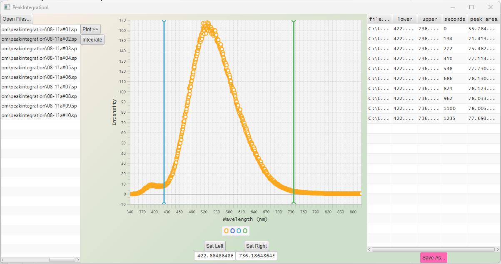

# GUI application to integrate peaks

This is a **javafx** application that allows:
 - open mutiple files
 - preview each file via a line chart
 - visually select the lower bound and upper bound
 - integrate all files
 - saved the result

This application uses the following techniques:
 - javafx to build the GUI
 - FXML to split the control and the model
 - SceneBuilder to build the look
 - CSS to style the appearance
 - Data processing to perform mathatical operations on data
 - File IO to process files
 - Serialization to store application configurations

 Demo

 